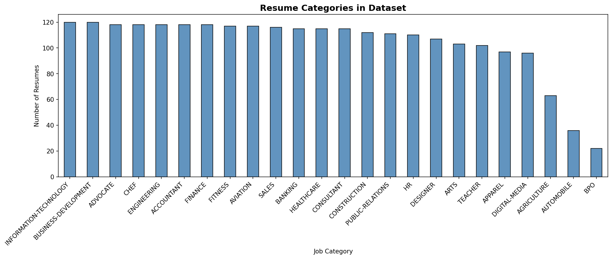
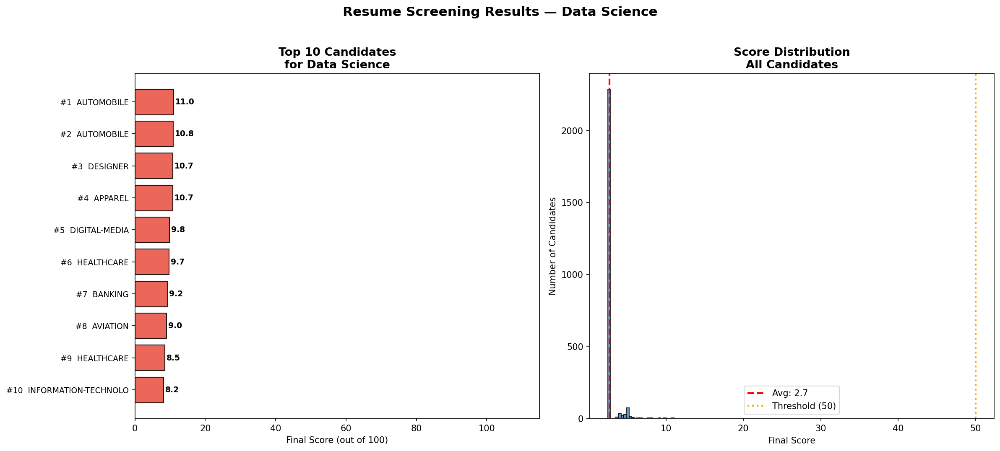
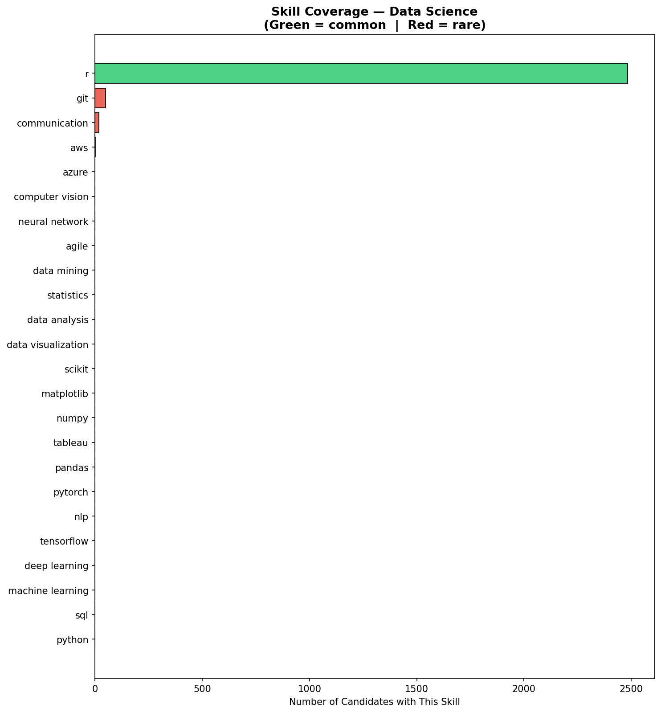

# 📄 Resume / Candidate Screening System
### Future Interns — Machine Learning Internship | Task 3


---

## 📌 Project Overview

An end-to-end **ML-powered Resume Screening System** that automatically reads, scores, and ranks candidate resumes based on a given job role — eliminating manual resume sorting for hiring teams.

> **Problem:** Hiring teams receive hundreds of resumes for a single role. Manually reading each one is slow, inconsistent, and error-prone.
>
> **Solution:** An NLP-powered system that instantly scores each resume against job requirements, ranks candidates, and highlights skill gaps.

---

## 🎯 Objectives

- Automatically extract skills from resume text using NLP
- Compare resumes against a job description using TF-IDF similarity
- Score and rank all candidates based on role fit
- Identify matched and missing skills for each candidate
- Provide a clear shortlist with verdict for each candidate

---

## 🗂️ Dataset

**Source:** [Resume Dataset — Kaggle](https://www.kaggle.com/datasets/snehaanbhawal/resume-dataset)

| Detail | Info |
|--------|------|
| Total Resumes | 2,484 |
| Job Categories | 25 |
| Format | CSV |
| Input Column | `Resume` (raw resume text) |
| Label Column | `Category` (job domain) |

---

## 🛠️ Tech Stack

| Tool | Purpose |
|------|---------|
| Python 3.10+ | Core language |
| pandas | Data loading and manipulation |
| NLTK | Stopword removal, lemmatization |
| spaCy | NLP pipeline |
| scikit-learn | TF-IDF vectorization, cosine similarity |
| matplotlib / seaborn | Data visualization |
| Google Colab | Development environment |

---

## ⚙️ How It Works

```
Raw Resume Text
      ↓
Text Cleaning (remove URLs, emails, noise → lowercase → lemmatize)
      ↓
Skill Extraction (match against 60+ skill keywords)
      ↓
      ├──→ TF-IDF Similarity Score  (40% weight)
      └──→ Skill Match Score        (60% weight)
                    ↓
            Final Score (0–100)
                    ↓
         Ranked Candidate List + Skill Gap Report
```

### Scoring Formula
```
Final Score = (Skill Match % × 0.60) + (TF-IDF Similarity % × 0.40)
```

| Score Range | Verdict |
|-------------|---------|
| > 60 | ✅ Strong Fit — Recommended for interview |
| 40 – 60 | 🟡 Moderate Fit — Consider with caution |
| < 40 | ❌ Weak Fit — Does not meet requirements |

---

## 📊 Results

### Screening Summary — Data Science Role

| Metric | Value |
|--------|-------|
| Total Resumes Screened | 2,484 |
| Average Score | ~XX% |
| Strong Fit (>60) | ~XX candidates |
| Shortlisted (>50) | ~XX candidates |

> 📝 Update the values above after running the notebook

---

## 🖼️ Visualizations

### Category Distribution


### Screening Results — Top 10 Candidates


### Skill Coverage Across Candidates


---

## 🔍 Sample Output

```
══════════════════════════════════════════════════════════════
  RANK #1  |  Category: Data Science
══════════════════════════════════════════════════════════════
  Final Score     : 78.4 / 100
  Skill Match     : 85.0%  (11/13 skills)
  Text Similarity : 68.2%

  Verdict : ✅ STRONG FIT — Recommended for interview

  ✅ Matched Skills : python, machine learning, deep learning,
                      tensorflow, pandas, numpy, scikit, sql,
                      data analysis, statistics, git

  ❌ Missing Skills : pytorch, computer vision
══════════════════════════════════════════════════════════════
```

---

## 📁 Project Structure

```
resume-screening/
│
├── resume_screening_v3.ipynb     # Main Jupyter Notebook (all code)
├── category_distribution.png     # Bar chart of resume categories
├── screening_results.png         # Top 10 candidates + score distribution
├── skill_coverage.png            # Skill frequency across all resumes
├── screening_results.csv         # Full ranked candidate output
└── README.md                     # This file
```

---

## ▶️ How to Run

### Google Colab (Recommended)
1. Open [Google Colab](https://colab.research.google.com)
2. Upload `resume_screening_v3.ipynb`
3. Run **Cell 1** → upload your `Resume.csv`
4. Run **Cell 2** → install spaCy → **Restart Runtime**
5. Run all remaining cells top to bottom

### Change Job Role
In **Cell 9**, change `SELECTED_JOB` to any category:
```python
SELECTED_JOB = "Data Science"   # Change to your desired role
```
Available roles: `Data Science`, `Web Designing`, `Java Developer`, `Python Developer`, `DevOps Engineer`, `Testing`, `HR`

---

## ✅ Features Implemented

- [x] Resume text cleaning with NLTK
- [x] Skill extraction from 60+ skill keywords
- [x] Job description parsing
- [x] TF-IDF cosine similarity scoring
- [x] Skill match percentage scoring
- [x] Combined final score with weighted formula
- [x] Candidate ranking (1 = best fit)
- [x] Skill gap identification per candidate
- [x] Interview verdict (Strong / Moderate / Weak fit)
- [x] Visual charts — top candidates, score distribution, skill coverage
- [x] Results exported to CSV

---

## 💼 Business Impact

| Without This System | With This System |
|--------------------|-----------------|
| Recruiters read 100s of resumes manually | Instant automated scoring |
| Inconsistent shortlisting decisions | Consistent, data-driven ranking |
| Hours spent per job opening | Results in seconds |
| Skills manually checked | Automatic skill gap report |
| High recruiter workload | Reduced to reviewing top-ranked only |

---

## 👤 Author

**Karthik Somu**
Machine Learning Intern — Future Interns

[](https://linkedin.com/in/your-profile)
[](https://github.com/your-username)

---

## 🏷️ Tags
`machine-learning` `nlp` `resume-screening` `text-similarity` `tfidf` `skill-extraction` `python` `sklearn` `nltk` `spacy` `future-interns` `hr-tech`
